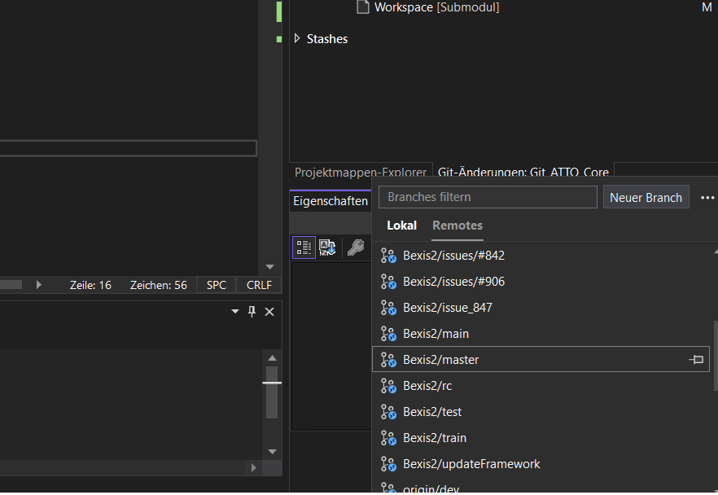
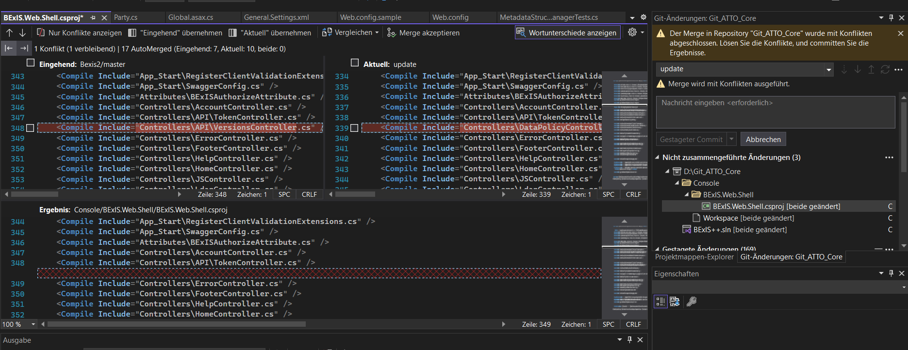
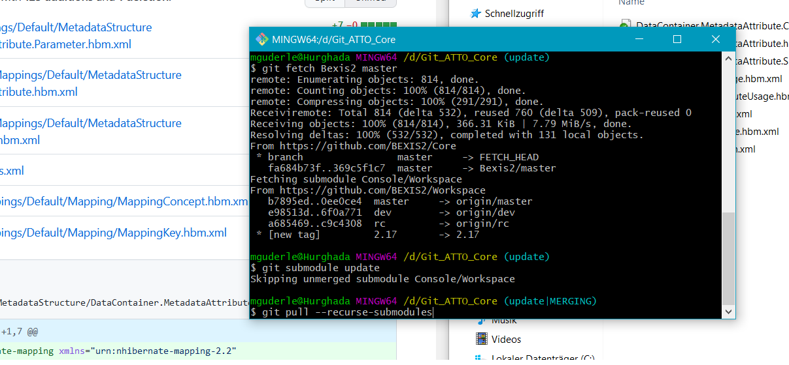

# How to update Bexis instance with new patch

#

Authors: Marcus Guderle

Contact ATTO Data Management Team: <attodbm@mpi-mail.mpg.de>

## Table of content

[1. Update local version with Microsoft Visual Studio](#1-update-local-version-with-microsoft-visual-studio)

[2. Update Postgres SQL](#2-update-postgres-sql)

[3. Build app in MS Visual Studio](#3-build-app-in-ms-visual-studio)

[4. Update Search](#4-update-search)

[5. Update Webconfig](#5-update-webconfig)

[6. Run app via MS Visual Studio locally](#6-run-app-via-ms-visual-studio-locally)

[7. Publish Webshell & Modules](#7-publish-webshell--modules)

[8. Update Bexis Instance on GWDG Server](#8-update-bexis-instance-on-gwdg-server)

[9. Update GitHub Repo from ATTO](#9-update-github-repo-from-atto)
 
 

## 1 Update local version with Microsoft Visual Studio
 

All steps described here require the folder structure which is available on the computer "Hurghada".

- Go to folder: `D:Git_ATTO_Core`
- Right click: `GitBash` 

    -> type: `git remote -v` 

    -> type: `git branch` to check the embedded remote repositories/branches

    -> type: `git fetch Bexis2 master` to fetch the current patch of Bexis from Bexis2 GitHub page

- Go to MS Visual Studio and right click on update (bottom right)

    -> remotes - Bexis2/master (right click) & `merge in current branch` 
     

    *Figure 1: Set remote branch in MS Visual Studio*
 
 
- Resolve merge conflicts 
 

    *Figure 2: Resolve merge conflicts*
 
 

- Resolve Workspace conflict using GitBash: 

    -> type: `git submodule update`

    -> type: `git pull --recurse-submodules`
 

    *Figure 3: Resolve merge conflicts for Workspace*
 
 

- Check in the Bexis release notes if all new files are in the workspace.

- Check if ATO modules, Credential file, Configuration file,  General settings for landing page etc & tenants are left in the folder

- If necessary, copy ATO-Module, Modules.Catalog.xml back in from the old structures

- If merge does not work in the workspace use GitBash:

    -> type: `git reset --hard origin/master`
 
 

## 2 Update Postgres SQL
 

- Use update script from folder `database update script` or from Bexis2 GitHub page 
 
 

## 3 Build app in MS Visual Studio
 

- Build on WebShell

- Build on Modules

- Build on Project 
 
 

## 4 Update Search
 

- Copy lucene settings in new DDM lucene folder
 
 

## 5 Update Webconfig
 
- Check path to new Workspace in webconfig

- Check DB, Version, credentials & ports
 
 

## 6 Run app via MS Visual Studio locally
 
... to check if all works (links, General Information page, Metadata export, ... )
  
 

## 7 Publish Webshell & Modules
 

- Copy Modules in `Area` folder into the Site folder

- Copy Workspace folder 
 
 

## 8 Update Bexis Instance on GWDG Server
 

- Create new folder wit Bexis version number

- Copy Site folder and Workspace folder 

- Run update script on Postgres SQL

- Change path in IIS

- Restart IIS

- Check running app on live webpage `www.attodata.org`
 
 

## 9 Update GitHub Repo from ATTO
 

- Push & Sync changes to https://github.com/ATTODataPortal/Core - branch: `update`

- Move & merge updates to branch `dev`:

    - Using GitHub interface  - "Pull requests" - "New pull request" 

    - Choose branches: left is target branch; right is source branch

    - Merge branches
